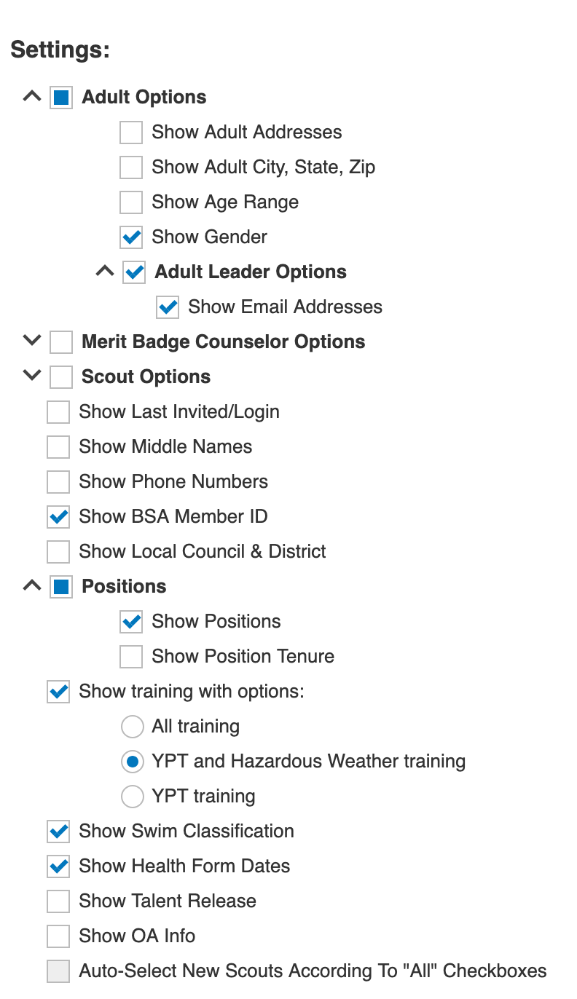

# scoutbook-tools
Some tools for working with [Scoutbook](https://scoutbook.scouting.org).


# Index

* [Scoutbook Roster Parser](#scoutbook-roster-parser-library)
* [Export Scoutbook Roster to Gaggle Mail](#export-scoutbook-roster-to-gaggle-mail)


# Scoutbook Roster Parser Library

The `roster` package provides a parser for Scoutbook roster CSV files, which can
be exported from Scoutbook using the Report Manager.  The parser is not
particularly flexible, so you need to export with the options detailed below in
the [Usage](#usage) section under [Export Scoutbook Roster to Gaggle Mail](#export-scoutbook-roster-to-gaggle-mail).

Here is a short example of how to use the `RosterParser`:

```go
package example

import "github.com/yourusername/scoutbook-tools/roster"

func main() {
  parser := roster.NewRosterParser("path/to/roster.csv")
  
  entries, err := parser.Parse()
  if err != nil {
    panic(err)
  }

  for _, entry := range entries {
    fmt.Println(entry.Name, entry.Email)
  }
}
```


# Export Scoutbook Roster to Gaggle Mail

This tool exports a Scoutbook roster into a CSV format suitable for importing
into Gaggle Mail.

## Usage

First you need to login to Scoutbook and export your adult roster as a CSV file.
Scoutbook doesn't allow youth emails to be exported, so this tool only helps
with adult rosters. The following options should be selected when you design
your report.



Example:
```shell
go run export-sb-roster-to-gaggle-mail.go \
  -roster roster/test_resources/adult-roster-example.csv
```

### Parameters:

- `-roster`: Path to the adult roster CSV file (required)
- `-output`: Path to the output CSV file (default: stdout)

### Output:

The tool generates a CSV file with the following columns:
- Name
- Email

> Note: Users without email addresses are omitted from the output.
